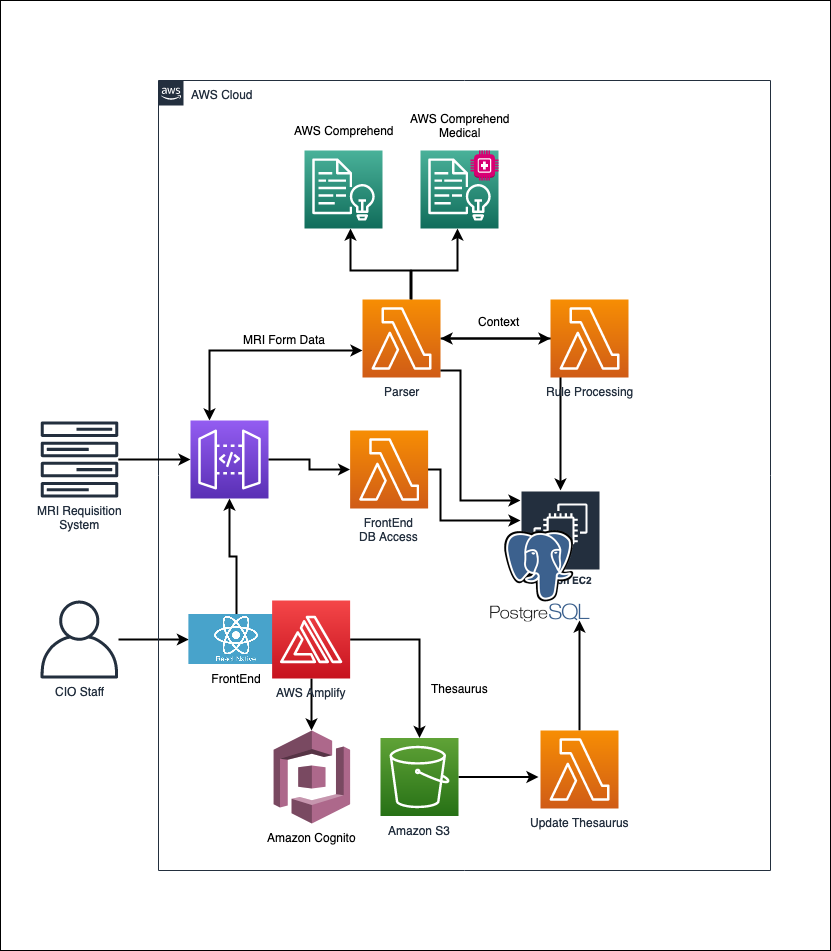

# VCH MRI Booking System

## Project Overview

A solution prototype utilizing AWS-managed Natural Language Processing (NLP) services: AWS Comprehend and AWS Comprehend Medical. A rules-based algorithm uses requisition samples to predict a output P-value based on the submitted criteria on MRI requisition that will help assign patients to an MRI site with the fastest turnaround time. This optimization will aim to decrease the current wait-list time and increase the number of patients who receive their exam within benchmarked wait times.

[UBC CIC Project Page](https://cic.ubc.ca/projects/vch-mri-project-cant-wait/)

## High level Architecture

## Deployment

To deploy this solution into your AWS Account please follow our [Deployment Guide](docs/deployment_guide.md)

## Backend Guide

Details in how the backend server work at [Backend Guide](docs/backend_guide.md)

## Frontend Guide

Details in how the application work at [Frontend Guide](docs/frontend_guide.md)

## Development Guide

Setting up local development environment [Dev Guide](docs/dev_setup.md)

### Further Recommendations

This is a proof of concept done by UBC CIC in collaboration with AWS. The algorithm can be improved by modifying weights and adding more words to conjunctions and spellchecker. Furthermore, one can also begin to consider the impact of other metadata that is already being recorded such as height, weight and age for scheduling an MRI scan.

## License

This project is distributed under the [MIT License](./LICENSE).
