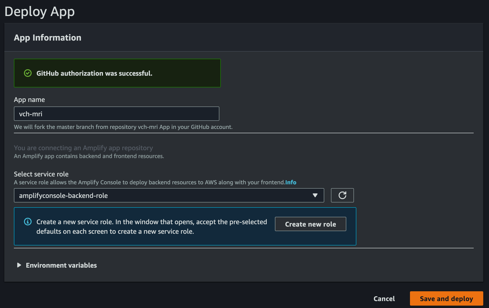
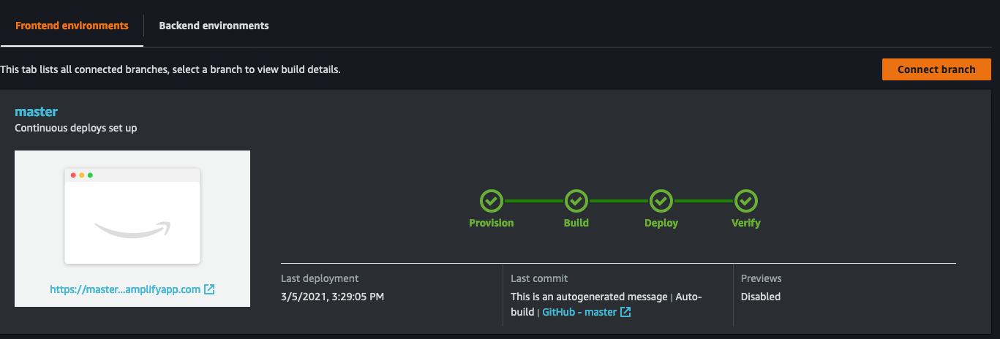

# Requirements
Before you deploy, you must have the following in place:
*  [AWS Account](https://aws.amazon.com/account/) 
*  [GitHub Account](https://github.com/) 
*  [AWS CLI](https://aws.amazon.com/cli/) 
*  [SAM CLI](https://docs.aws.amazon.com/serverless-application-model/latest/developerguide/serverless-sam-cli-install.html) 
*  [Amplify CLI installed and configured](https://aws-amplify.github.io/docs/cli-toolchain/quickstart#quickstart) 

# Step 1: Back-end deployment

1. Store the database username and password at Systems Manager Parameter Store. **Make sure to replace DATABASENAME and DATABASEPWD with the respectives username and password you want to use for the database**.
```bash
aws ssm put-parameter --name "/mri-sched/dbuser_ec2" --value "DATABASENAME" --type SecureString --overwrite
aws ssm put-parameter --name "/mri-sched/dbpwd_ec2" --value "DATABASEPWD" --type SecureString --overwrite
```

2. In this step we will execute AWS SAM guided configuration by running. 
```bash
sam deploy -g --capabilities CAPABILITY_IAM CAPABILITY_AUTO_EXPAND CAPABILITY_NAMED_IAM
```

To deploy the solution into an existent VPC please use the following command:
```bash
sam deploy -g -t template-novpc.yaml --capabilities CAPABILITY_IAM CAPABILITY_AUTO_EXPAND CAPABILITY_NAMED_IAM
```

3. Provide the stack name, region and the key-pair name. For all the other questions, please accept the default answers or select *Y*. Below an example:

```
Configuring SAM deploy
======================

	Looking for config file [samconfig.toml] :  Not found

	Setting default arguments for 'sam deploy'
	=========================================
	Stack Name [sam-app]: mri-sched
	AWS Region [us-east-1]: [Your-AWS-REGION]
	Parameter CidrBlockVpcParameter [10.0.0.0/16]:
	Parameter PrivateSubnetAParameter [10.0.1.0/24]:
	Parameter PublicSubnetAParameter [10.0.2.0/24]:
	Parameter DBInstanceTypeParameter [t3.medium]:
	Parameter AMIID [/aws/service/ami-amazon-linux-latest/amzn2-ami-hvm-x86_64-gp2]:
	#Shows you resources changes to be deployed and require a 'Y' to initiate deploy
	Confirm changes before deploy [y/N]: y
	#SAM needs permission to be able to create roles to connect to the resources in your template
	Allow SAM CLI IAM role creation [Y/n]: y
	Preprocess may not have authorization defined, Is this okay? [y/N]: y
	QueryRules may not have authorization defined, Is this okay? [y/N]: y
	QuerySpellchecker may not have authorization defined, Is this okay? [y/N]: y
	QueryConjunctions may not have authorization defined, Is this okay? [y/N]: y
	QueryWeights may not have authorization defined, Is this okay? [y/N]: y
	QuerySpecialtyTags may not have authorization defined, Is this okay? [y/N]: y
	DataResults may not have authorization defined, Is this okay? [y/N]: y
	Save arguments to configuration file [Y/n]: y
	SAM configuration file [samconfig.toml]:
	SAM configuration environment [default]:
```

4. Confirm the deployment and wait for the stack to be created.


If you need to connect to the EC2 Postgres database, you can securelly access the server using [AWS Systems Manager Session Manager](https://docs.aws.amazon.com/systems-manager/latest/userguide/session-manager.html). 

```
aws ssm start-session --region {YOUR-REGION} --target {YOUR-INSTANCE-ID} 
```


# Step 2: Front-end deployment

The **Deploy to Amplify Console** button will take you to your AWS console to deploy the front-end solution. Make sure you are connecting to the same AWS Account you deployed the backend solutio.

<a href="https://console.aws.amazon.com/amplify/home#/deploy?repo=https://github.com/UBC-CIC/vch-mri">
    
</a>


The follow screenshots shows how simple this step is:

1. 

2. 

3. 

