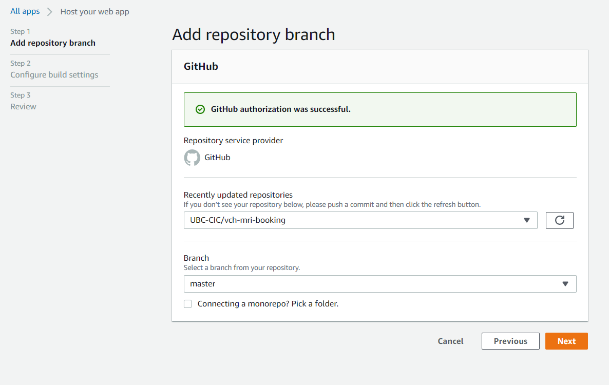
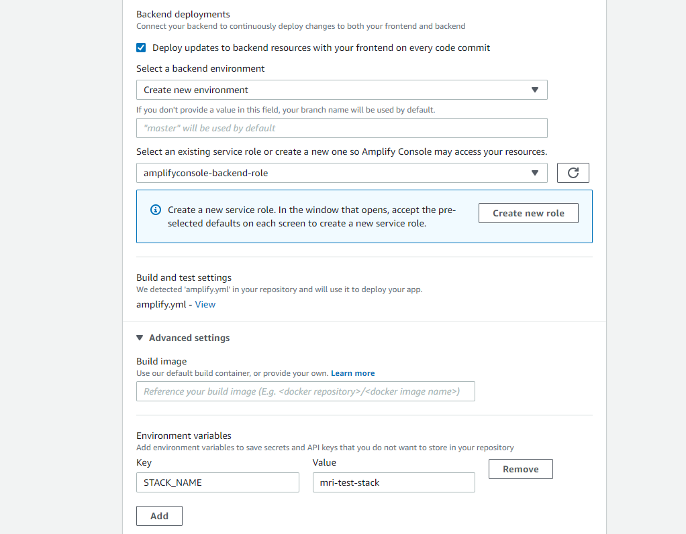
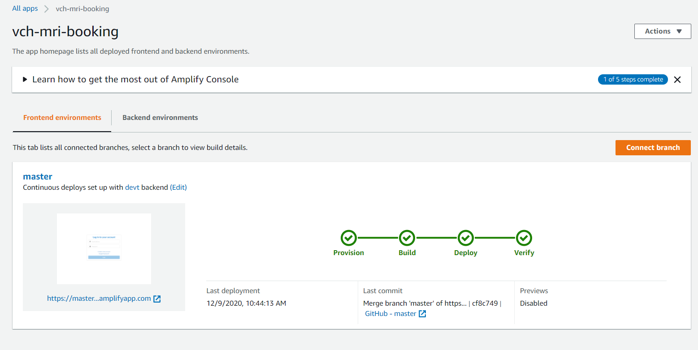
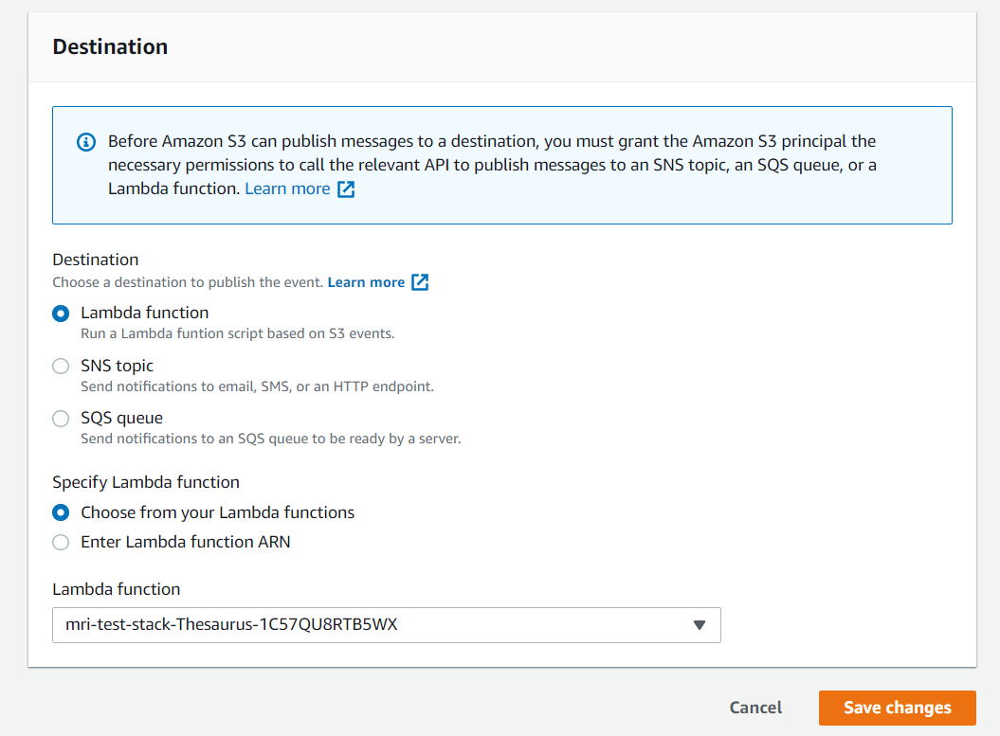
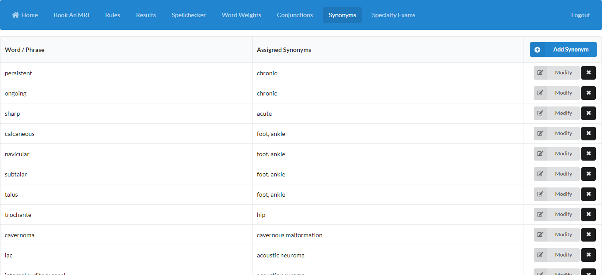

# VCH MRI Booking System - Frontend UI

This project was bootstrapped with [Create React App](https://github.com/facebook/create-react-app).

## Requirements

Before deployment, you should have the following:

* [AWS Account](https://aws.amazon.com/account/)
* [GitHub Account](https://github.com)

**Frontend deployment requires that the backend is successfully deployed after running the cloudformation code in the [Backend Documentation](../backend/README.md).**

## Installation

Follow these instructions to deploy the frontend:

1) Fork and clone this repository into your Github account.
2) From the AWS Amplify page in the AWS Console, select **Host web app** under the **New app** dropdown, and select Github as the repository option.
3) After authenticating into your Github account, select the forked repository under the repository dropdown. Select master branch.

4) On the next page, **App build and test settings**, keep the default build settings. You can rename the app name.
5) Select **Create new environment** under the **Select a backend environment** dropdown, and select your AWS Amplify service role in the following dropdown if one exists; if not, Select 'Create new role' and quickly create one using the default settings and refresh the role selection.
6) Expand **Advanced Settings** at the bottom, and under **Environment variables** add a variable with key `STACK_NAME` and value being the CloudFormation stack name used for the backend deployment.

7) In the next screen, review the settings and click **Save and deploy**, and wait for the deployment build to complete, which will take some time.

8) Navigate to S3 to view the newly created S3 bucket from deployment, with name starting with `vch-mri-thesaurusfilebucket`.
9) Within that bucket, create a folder titled `public`, and then upload the `thesaurus_medical.ths` file [in here](../backend/csv) into that folder. Be sure not to change the file name.

10) Go to the bucket properties tab. Enable versioning, and create a bucket event notification with the following settings. Check off **All object create events** under **Event types**. Select **Lambda Function** under **Destination**, and select the Thesaurus lambda function that starts with your provided backend stack name under **Lambda function** dropdown after selecting **Choose from your lambda functions**.

Within Amplify Console, you should see an auto-generated URL under **Frontend environment** - that is the URL you will use to access the MRI booking system. You can now create your user accounts and log in the system.

## Logging in

Cognito is used for user authentication. Users will need to input their email address, name and a strong password to create an account.
After account creation, users will need to verify their account by inputting the 6-digit verification code that was sent to their provided email address before being able to log in to the system.

## Pages
All page tables in the frontend are sortable by column. Users can click on the header cells of a column to sort the rows
in ascending / descending order.

#### Book An MRI
Page containing MRI intake form for users to input data. Will display important information such as priority value,
contrast info and the relevant MRI rule ID on successful form submission.

#### Rules
Page containing table of all defined MRI rules that define the algorithm. Users can add new rules and modify them, and
can also activate and deactivate them using the toggle on the left side of the row.

#### Results
Page containing table of all stored MRI booking results in the database. Users can use the table pagination to navigate
through pages of results; each page contains 50 rows. Users can also use the search bar to request a specific result by reqCIO.

Users can also view any additional information regarding a MRI booking result by clicking on the info button on the right
side of its row. Users may also change priority and contrast values for a certain MRI booking result using the row
dropdowns if they wish.

#### Synonyms
Page containing table of all defined synonym relations in the PostgreSQL synonym dictionary, stored in the
`thesaurus_medical.ths` file in the Amplify S3 bucket. Users can add, modify and delete synonym relations. In the add and
modify synonym views, users will type a word/phrase in the first input field. Users can input synonyms in the second
input field by typing a word/phrase and then pressing the Enter key to confirm the synonym. Synonyms will show up as deletable 
tags below the input fields. With this layout, you can easily define one or even multiple synonyms for a certain word/phrase.

#### Spellchecker
Page containing table of all defined words in the spellcheck dictionary. Users can add frequently misspelled medical
words here, or they can also delete them.

#### Word Weights
Page containing table of all defined weight mappings to medical words. Possible weights are A, B, C, and D, from highest
to lowest. Users can add word / weight mappings, modify the weight of a certain word from the dropdown, or delete them.

#### Conjunctions
Page containing table of all mappings of medical abbreviations to their respective definitions. Users can add, modify or delete
medical abbreviations here.

#### Specialty Exams
Page containing table of defined specialty medical exams to be considered by the rules-based algorithm. Users can add
or delete specialty exams here.